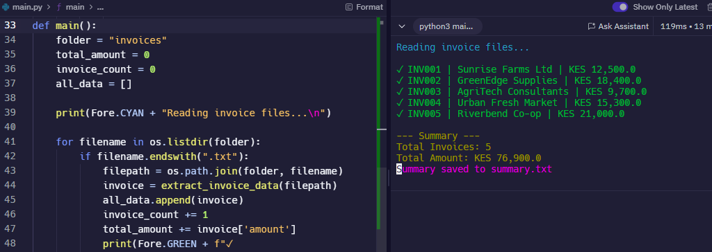

# Invoice Summarizer 🧾

A simple Python automation tool that reads invoice `.txt` files, extracts key details (invoice number, client name, and amount), and generates a clear summary report in a `.txt` file.

---

## ✅ Features

- Processes all `.txt` invoice files in a folder
- Extracts structured invoice data
- Summarizes total number of invoices and total amount
- Saves a clean, formatted summary to `summary.txt`
- Uses `colorama` for color-coded terminal output

---

## 🖥️ Sample Output

---

## 🛠 Technologies Used
- Python 3
- Built-in modules: `os`, `datetime`
- External module: `colorama`
- 
---

## 📁 Example Invoice Format

Each invoice file should follow this format:
Invoice Number: INV001
Client: Sunrise Farms Ltd
Amount: KES 12,500

yaml
Copy
Edit

---

## 🔄 How to Use

1. Create a folder called `invoices/`
2. Add `.txt` files formatted like above
3. Run `main.py`
4. View summary in terminal and in `summary.txt`
   
---

## 🙌 Author

**Eric Mutisya**  
Python Developer | Web Developer | Freelancer  
Upwork Profile: https://www.upwork.com/freelancers/~012558bab6232e8e65

---

## 📄 License

This project is licensed under the [MIT License](LICENSE).  
You are free to use, modify, and distribute this project with attribution.

---

## 🙋‍♂️ Author's Note

This project was built as part of my practical journey into freelance development using Python.  
If you're a client looking for a similar automation or document solution — I'd be happy to help!  
Let’s connect on [Upwork](https://www.upwork.com/freelancers/~012558bab6232e8e65) or [GitHub](https://github.com/Ek-Coder-Tech).
